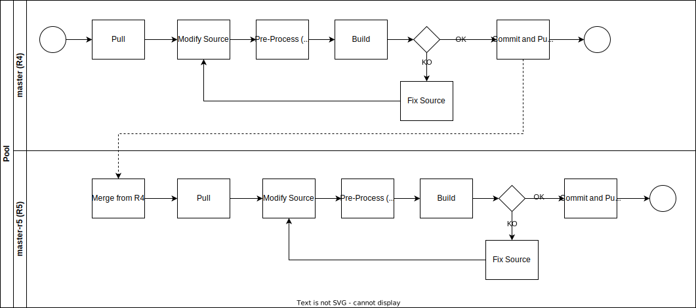

# HL7 Europe Base Profiles and Common Artefacts
This guide collects HL7 Europe base and other common profiles and artefacts.

Base profiles aim to specify how concepts commonly used in Europe are represented in HL7 FHIR. These profiles, loosly constrained, are intended to be used as basis for any European derived profile.

This version of the guide includes also more constrained profiles, called core profiles, that constitutes a sort of buldingblocks to be reused in the arge majority of the EU REALM HL7 FHIR IGs.

Two versions of the guide are publised the 
* HL7 FHIR R4 Base IG (hl7.fhir.eu.base.r4)
  * [Github master branch](https://github.com/hl7-eu/base);
  * [CI-build](https://build.fhir.org/ig/hl7-eu/base/)
* HL7 FHIR R5 Base IG (hl7.fhir.eu.base.r5)
  * [Github r5-master branch](https://github.com/hl7-eu/base/tree/r5-master);
  * [CI-build](https://build.fhir.org/ig/hl7-eu/base/branches/r5-master/)

## How to Contribute

Both versions of the guide are managed by the same source code, to do this a special directory ( __r4-r5 ) has been created.

This directory should have the usual IG structure used for the HL7 FHIR IGs, where __r4-r5 corresponds to the root directory.

The __r4-r5 directory includes all the source files containing R4 / R5 specific instructions, files that are  supposed to be preproccesed and copied under the root directory.

The pre-processing script is recorded in the scripts folder.

Any change on the source files that may include R4/R5 specific instructions MUST BE DONE on the files recorded in the __r4-r5 dir.

Changes have to be done on the master branch (currently the R4 guide) following this process.

DO NOT apply changes on the sources directly on the master-r5 branch.

