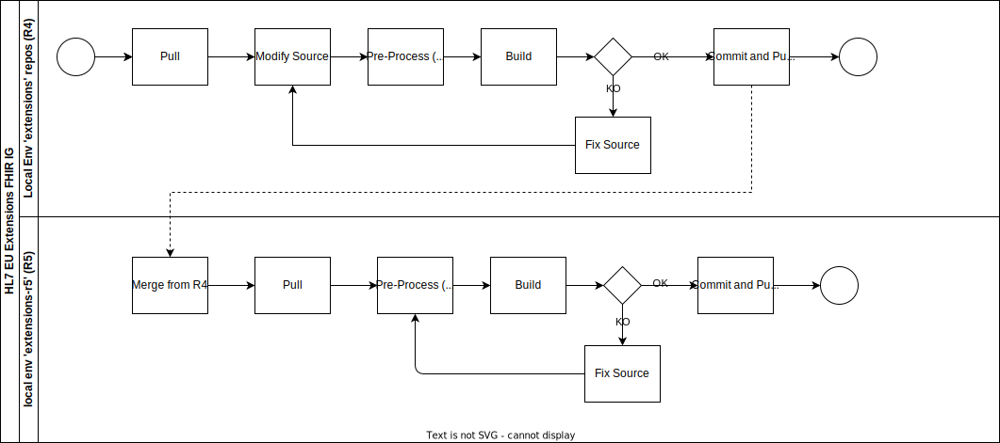

# HL7 Europe Base Profiles and Common Artefacts

This guide collects HL7 Europe base and other common profiles and artefacts.

Base profiles specifies how concepts commonly used in Europe are represented in HL7 FHIR. These profiles, loosly constrained, are intended to be used as basis for any European derived profile.

This version of the guide includes also more constrained profiles, called core profiles, that constitutes a sort of building blocks to be reused for the large majority of the EU REALM HL7 FHIR IGs.

Two versions of the guide are publised the 
* HL7 FHIR R4 Base IG (hl7.fhir.eu.base.r4)
  * [Github master branch](https://github.com/hl7-eu/base);
  * [CI-build](https://build.fhir.org/ig/hl7-eu/base/)
* HL7 FHIR R5 Base IG (hl7.fhir.eu.base.r5)
  * [Github r5-master branch](https://github.com/hl7-eu/base/tree/r5-master);
  * [CI-build](https://build.fhir.org/ig/hl7-eu/base/branches/r5-master/)

## How to Contribute

The goal is to use the same GitHub repos for both HL7 FHIR versions (R4, R5) of the guide.

To support this a special directory, called __r4-r5, has been created.

This directory has the same structure used for the HL7 FHIR IGs (where __r4-r5 corresponds to the root directory), and includes all the source files containing R4 / R5 specific instructions.

These "special" source files are pre proccesed by the python script in the 'scripts' folder and copied in the root directory. 
The script generates the apporpriate source file for the HL7 FHIR version choosen. 

Any change in the source files that are present in both the root and in the '__r4-r5' folders MUST BE DONE updating the files in the '__r4-r5' folder.
(Otherwise your changes will be overwritten)

Moreover any change applied to the source files have to be done on the master branch (currently the R4 guide), rebuilding the R5 version following this process.

DO NOT apply changes on the sources directly on the master-r5 branch.

